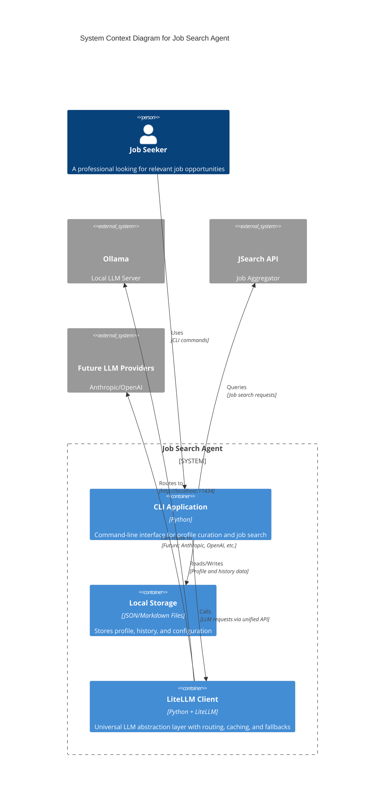
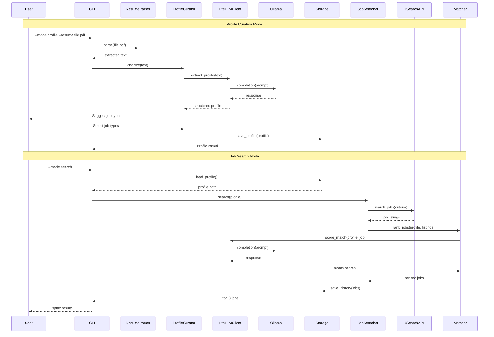

****# Job Search Agent - Architecture Design

## 3.1 System Context



## 3.2 Component Design

### Core Components

| Component | Responsibility | Technology | Interfaces |
|-----------|---------------|------------|------------|
| **CLI Entry Point** | Main application orchestrator, argument parsing, mode routing | Python (argparse) | Command-line interface |
| **Resume Parser** | Extract text from PDF/DOCX files | pdfplumber, python-docx | File input → Extracted text |
| **Profile Curator** | Interactive profile setup, LLM-based analysis, Q&A flow | Python + LiteLLM | Resume text → Curated profile |
| **Job Searcher** | Execute job searches, filter results, manage search parameters | Python + JSearch API | Search criteria → Job listings |
| **Matcher Engine** | Calculate profile-job match scores using weighted algorithm | Python + LiteLLM | Profile + Job → Match score |
| **LiteLLM Client** | Universal LLM interface with routing, caching, fallbacks, and retries | Python + LiteLLM | Prompt → LLM response (provider-agnostic) |
| **Storage Manager** | Handle reading/writing of profile, history, and config files | Python (json, yaml) | Data objects ↔ File system |
| **Configuration Manager** | Load and validate application configuration including LiteLLM settings | Python (yaml) | Config files → Settings objects |

### Component Interaction Flow



## 3.3 Data Design

### Data Stores

| Store | Format | Purpose |
|-------|--------|---------|
| `data/profile.json` | JSON | Machine-readable profile data |
| `data/profile.md` | Markdown | Human-readable profile summary |
| `data/history.json` | JSON | Machine-readable job history |
| `data/history.md` | Markdown | Human-readable job history |
| `config/config.yaml` | YAML | Application configuration including LiteLLM settings |
| `config/system_prompts.md` | Markdown | LLM system prompts |
| `data/resumes/` | PDF/DOCX | Backup copies of uploaded resumes |
| `.cache/litellm/` | SQLite/JSON | LiteLLM response cache (optional) |

### Key Data Models

**Profile (profile.json)**
```json
{
  "personal_info": {
    "name": "string",
    "email": "string",
    "location": "string"
  },
  "skills": ["string"],
  "experience": {
    "years": "number",
    "roles": ["string"],
    "industries": ["string"]
  },
  "education": [
    {
      "degree": "string",
      "field": "string",
      "institution": "string"
    }
  ],
  "job_types": ["string"],
  "preferences": {
    "locations": ["string"],
    "remote": "boolean",
    "salary_range": {"min": "number", "max": "number"},
    "employment_types": ["string"]
  },
  "resume_file": "string",
  "created_at": "timestamp",
  "updated_at": "timestamp"
}
```

**History Entry (history.json)**
```json
{
  "job_id": "string",
  "title": "string",
  "company": "string",
  "url": "string",
  "match_score": "number",
  "shown_at": "timestamp",
  "job_type": "string"
}
```

### Data Flow

1. **Profile Curation Flow**:
   - Resume file → Resume Parser → Extracted text
   - Extracted text → LiteLLM Client → Ollama (Mistral) → Structured profile data
   - User selections → Profile Curator → Enhanced profile
   - Enhanced profile → Storage → Persistent files

2. **Job Search Flow**:
   - Profile data → Job Searcher → JSearch API query
   - JSearch API → Job listings
   - Job listings + Profile → Matcher → LiteLLM Client → Ollama → Match scores
   - Ranked jobs → Storage (history) + CLI (display)

## 3.4 Key Architectural Decisions

### ADR-001: Local File Storage over Database

**Status:** Accepted

**Context:** Need to store profile, history, and configuration data for a single-user CLI application.

**Decision:** Use JSON/Markdown files for data storage instead of SQLite or other database.

**Rationale:**
- Single-user scenario doesn't require database features
- Human-readable formats (Markdown) provide transparency
- Simpler implementation and debugging
- Easy backup and version control
- No database dependencies or connection management

**Consequences:**
- Limited querying capabilities (acceptable for small datasets)
- No concurrent access support (not needed for single user)
- Manual data migration if schema changes

### ADR-002: LiteLLM as Universal LLM Abstraction Layer

**Status:** Accepted

**Context:** Need a flexible LLM integration that supports current Ollama Mistral and future providers (Anthropic, OpenAI) without code changes.

**Decision:** Use LiteLLM library as the sole LLM interface, providing a unified API for all LLM providers.

**Rationale:**
- Single unified API for all LLM providers (Ollama, Anthropic, OpenAI, etc.)
- Provider switching via configuration only, no code changes
- Built-in advanced features: caching, fallbacks, retries, cost tracking
- Active maintenance and broad provider support
- Future-proofs the application for LLM provider changes

**Consequences:**
- Additional dependency (litellm library)
- Need to understand LiteLLM's model naming convention
- Slight abstraction overhead (acceptable for benefits)
- Must maintain LiteLLM configuration properly

### ADR-003: Weighted Scoring Algorithm for Job Matching

**Status:** Accepted

**Context:** Need to calculate relevance scores between user profiles and job descriptions.

**Decision:** Use a configurable weighted scoring system with multiple dimensions (skills, experience, job type, location, industry).

**Rationale:**
- Transparent and explainable scoring
- User can adjust weights based on priorities
- Combines rule-based and AI-enhanced matching
- Easy to debug and iterate on

**Consequences:**
- Requires careful weight tuning
- May not capture complex semantic relationships alone
- Supplement with LLM analysis for nuanced matching

### ADR-004: JSearch API for Job Aggregation

**Status:** Accepted

**Context:** Need a comprehensive job search API that aggregates listings from multiple sources.

**Decision:** Use JSearch API from RapidAPI as the primary job data source.

**Rationale:**
- Aggregates from multiple job boards (LinkedIn, Indeed, Glassdoor, etc.)
- Provides structured job data with descriptions
- Reasonable free tier for individual use
- Well-documented REST API

**Consequences:**
- Dependency on third-party API availability
- Rate limits on free tier (100 requests/month)
- Potential costs for heavy usage
- Limited control over data freshness

### ADR-005: LiteLLM Features Utilization Strategy

**Status:** Accepted

**Context:** LiteLLM provides advanced features beyond simple routing. Need to define which features to leverage.

**Decision:** Utilize LiteLLM's caching, fallbacks, retries, and cost tracking capabilities.

**Rationale:**
- **Caching:** Reduces redundant LLM calls, improves response time, saves compute
- **Fallbacks:** Increases reliability by falling back to alternative models if primary fails
- **Retries:** Automatic retry logic with exponential backoff for transient failures
- **Cost Tracking:** Monitor token usage even for local models for future cost analysis

**Consequences:**
- More complex configuration required
- Cache management needed (storage, invalidation)
- Need to define fallback models and strategies
- Additional monitoring for cost tracking

## 3.5 Scalability and Availability Strategy

### Scalability
- **Horizontal Scaling:** Not applicable (single-user CLI)
- **Vertical Scaling:** Local resources sufficient for individual use
- **API Scaling:** JSearch API handles scaling on their end
- **LLM Scaling:** Ollama runs locally; future cloud providers handle their own scaling

### Availability
- **Offline Capability:** Profile and history accessible without internet
- **Graceful Degradation:** Job search fails gracefully if APIs unavailable
- **Error Handling:** Comprehensive error messages and recovery options
- **LiteLLM Fallbacks:** If Ollama fails, can fallback to alternative models (when configured)

### Caching Strategy
- **Profile Caching:** Load profile once per session
- **History Caching:** In-memory history during session, persisted after
- **LLM Response Caching:** LiteLLM caching for repeated prompts (configurable)
- **API Response Caching:** Not implemented (avoid stale job data)

### Async/Queue Patterns
- **Not Required:** Synchronous CLI interaction pattern
- **Future Consideration:** Background job monitoring if real-time alerts added

## 3.6 Security Design

### Authentication & Authorization
- **API Authentication:** Environment variables for API keys
- **Local Access:** File system permissions for data protection
- **No User Authentication:** Single-user application
- **Ollama Access:** Localhost-only access (no external exposure)

### Data Encryption
- **At Rest:** Rely on file system encryption (OS-level)
- **In Transit:** HTTPS for all external API communications
- **Local LLM:** No data transmission for Ollama (local processing)

### Compliance Controls
- **Data Minimization:** Only collect necessary profile information
- **Local Storage:** No cloud storage of personal data
- **API Privacy:** Minimal data sent to external services
- **Local LLM Privacy:** All LLM processing stays on user's machine with Ollama

## 3.7 Open Risks

1. **Ollama Setup Complexity:** Users must install and configure Ollama correctly
2. **Model Performance:** Local Mistral 7B may have different capabilities vs cloud models
3. **Resource Usage:** Running Ollama locally consumes RAM and CPU
4. **JSearch API Rate Limits:** Free tier limited to 100 requests/month
5. **Resume Parsing Accuracy:** Python libraries may struggle with complex resume formats
6. **Job Data Freshness:** JSearch API may not have real-time job listings
7. **Geographic Coverage:** JSearch may have limited coverage in certain regions
8. **Match Score Accuracy:** Weighted algorithm may not perfectly capture job fit
9. **LiteLLM Configuration Complexity:** More complex than direct API calls
10. **Cache Management:** Need to define cache invalidation strategy****